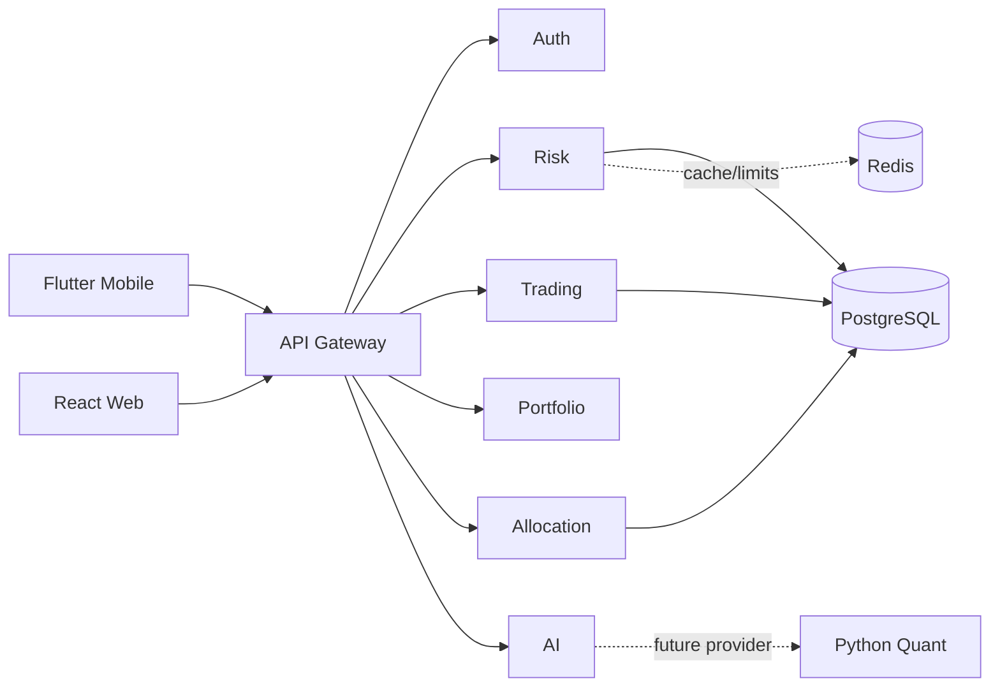

# Tipkhun Capital service boundaries

The monorepo starts with independently buildable Node/Express service boundaries. The API gateway is the only client-facing entry point. Services return explicit `501` responses until their persistence and authorization are implemented; a placeholder is not presented as a live capability.

| Service | Responsibility | Current status |
| --- | --- | --- |
| api-gateway | request IDs, CORS/Helmet, client API boundary, risk proxy | runnable |
| auth-service | registration/session/RBAC boundary | route scaffold, no persistence |
| risk-service | deterministic risk check | runnable and tested |
| trading-service | orchestration/paper order boundary | scaffold, Flutter Paper remains active implementation |
| allocation-service | realized-profit allocation boundary | scaffold; Flutter Profit Router remains active |
| portfolio-service | holdings and simulation boundary | scaffold, returns no fabricated holdings |
| ai-service | provider/coplay boundary | Mock-only response; no key |
| notification-service | event notification boundary | disabled scaffold |
| quant-service | future Python/FastAPI research boundary | contract notes only |

PostgreSQL is the source of transactional financial records. Redis is reserved for cache, rate limiting, heartbeat and queues; it must never become the accounting source of truth. REST is used first. Domain event names are defined in `packages/shared` so a later queue can be introduced without coupling clients to broker details.

